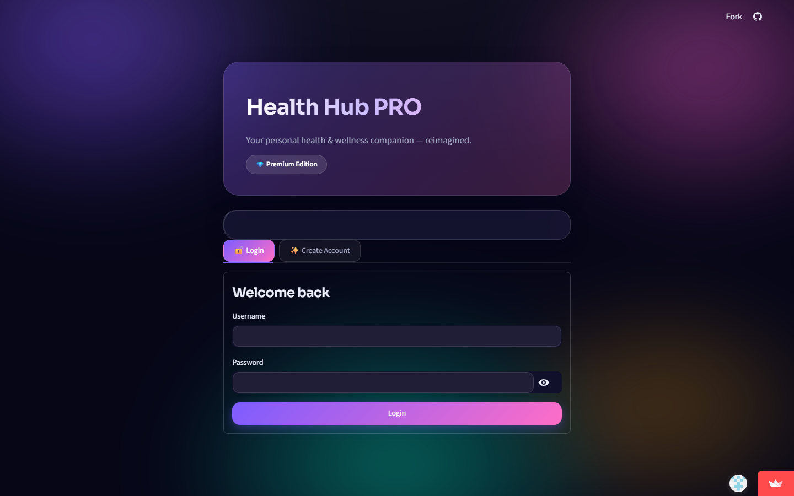
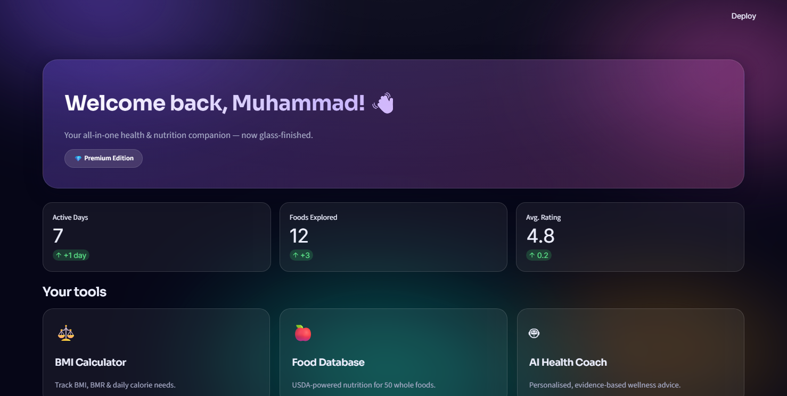
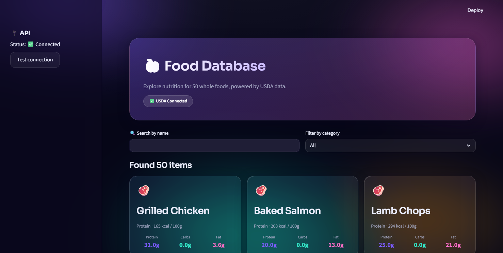
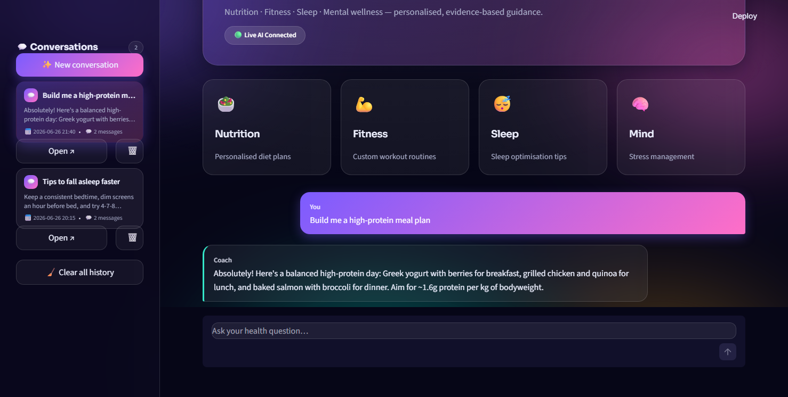

# 💎 Health Hub PRO

[](https://health-app-z4pzhwxqyrtwisc5jlenab.streamlit.app/)
[](https://www.python.org/)
[](https://streamlit.io/)

A premium health & wellness app with a glassmorphism + animated aurora UI,
built with Streamlit. Rebuilt from a single-file prototype into a clean,
modular project with **private API keys**.

### 🔗 [Live Demo →](https://health-app-z4pzhwxqyrtwisc5jlenab.streamlit.app/)

## 📸 Screenshots

| Sign in | Dashboard |
|---|---|
|  |  |

| Food Database | AI Health Coach |
|---|---|
|  |  |

## ✨ Features
- **Dashboard** — personalised greeting, quick stats and tool tiles
- **BMI & TDEE Calculator** — body metrics with a glass results panel
- **Food Database** — 50 whole foods with live USDA nutrition lookups
- **AI Health Coach** — premium glass chat (Groq LLM) with saved history

## 🔐 Keeping your API keys private
Keys are **never** stored in the source code. They load from
`.streamlit/secrets.toml` (which is gitignored) or environment variables.

1. Copy the template:
   ```
   cp .streamlit/secrets.toml.example .streamlit/secrets.toml
   ```
2. Put your real keys in `.streamlit/secrets.toml`:
   ```toml
   USDA_API_KEY = "..."
   GROQ_API_KEY = "..."
   ```
The app still runs without keys — it falls back to built-in nutrition data
and an offline coach.

## 🚀 Run it
```bash
pip install -r requirements.txt
streamlit run app.py
```

## ☁️ Deploy on Streamlit Community Cloud
1. Go to **https://share.streamlit.io** and sign in with GitHub.
2. Click **Create app → Deploy a public app from GitHub**.
3. Fill in:
   - **Repository:** `MuhammadHamza2210/Health-Hub`
   - **Branch:** `main`
   - **Main file path:** `app.py`
4. Open **Advanced settings → Secrets** and paste your keys (TOML format):
   ```toml
   USDA_API_KEY = "your_usda_key"
   GROQ_API_KEY = "your_groq_key"
   ```
   These live only in Streamlit's dashboard — never in the repo.
5. Click **Deploy**. Your app goes live at
   `https://<your-app-name>.streamlit.app`.

> Note: the cloud filesystem is ephemeral, so `data/` (accounts & chat history)
> resets when the app restarts. That's expected for a free demo deployment.

## 🗂️ Project structure
```
app.py                     # entry point, auth gate, navigation
.streamlit/
  config.toml              # dark aurora theme
  secrets.toml             # YOUR private keys (gitignored)
  secrets.toml.example     # template to copy
healthhub/
  config.py                # constants + private key loader
  styles.py                # glassmorphism aurora CSS
  auth.py                  # login / signup
  services/
    nutrition.py           # USDA API
    ai_coach.py            # Groq API
  pages/
    dashboard.py
    bmi.py
    food.py
    coach.py
data/                      # users & chat history (gitignored)
```
